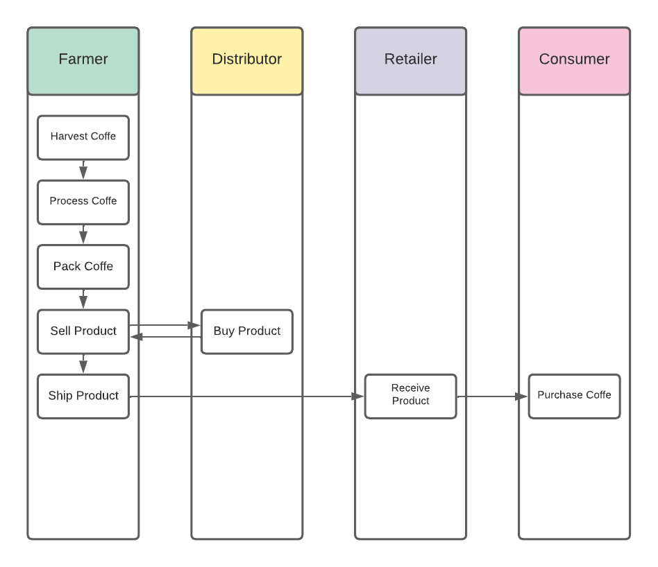
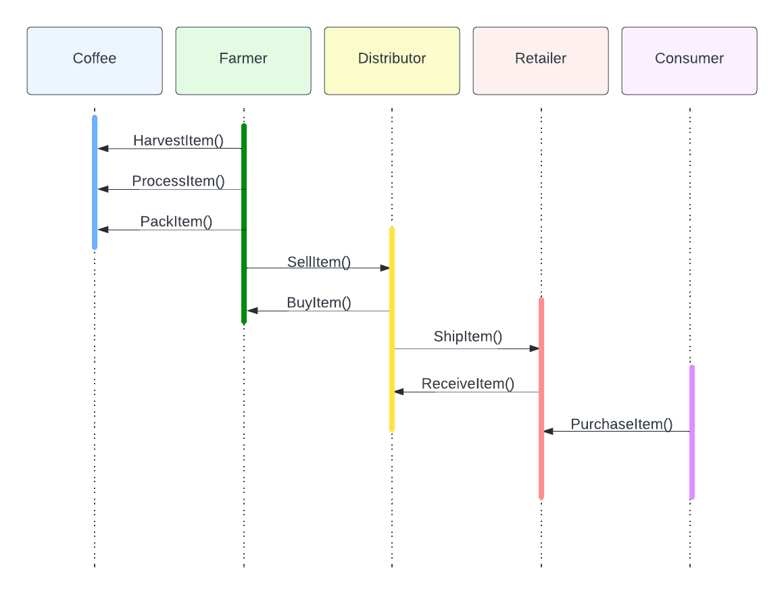
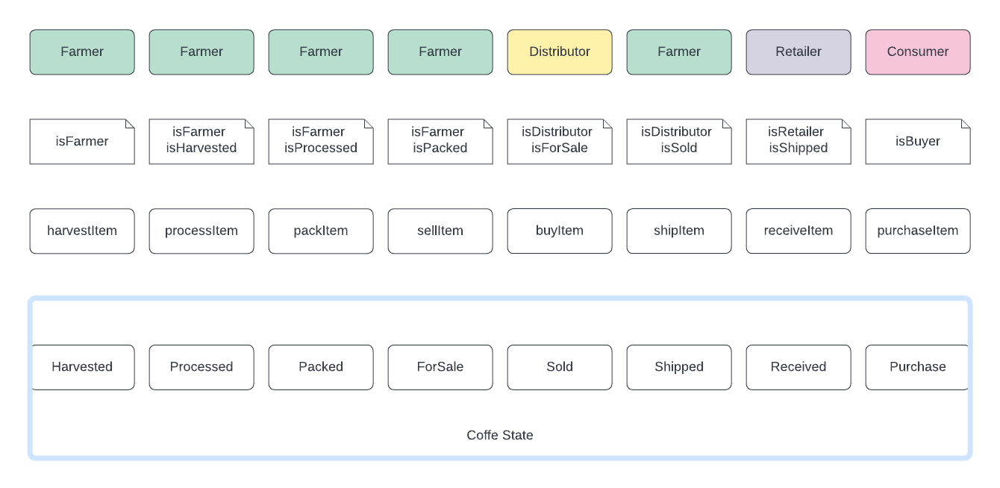

# Submission Requirement

## Project Planning

### UML

#### Activity Diagram

#### Sequence Diagram

#### State Diagram

#### Class Diagram

## Dependencies

This project uses the following libraries:

- web app:

    lite-server v2.6.1

- contracts

    Truffle v5.5.22 (core: 5.5.22)
    Ganache v7.3.2
    Solidity v0.5.16 (solc-js)
    Node v12.22.12
    Web3.js v1.7.4

## Contract Hash

The contract has been deployed on the Rinkeby Test Network getting the following contract address:

- 0x66764d55f81cc6c04484919f02d723b1aeafc3c3bbe659f988b085777018c1f9